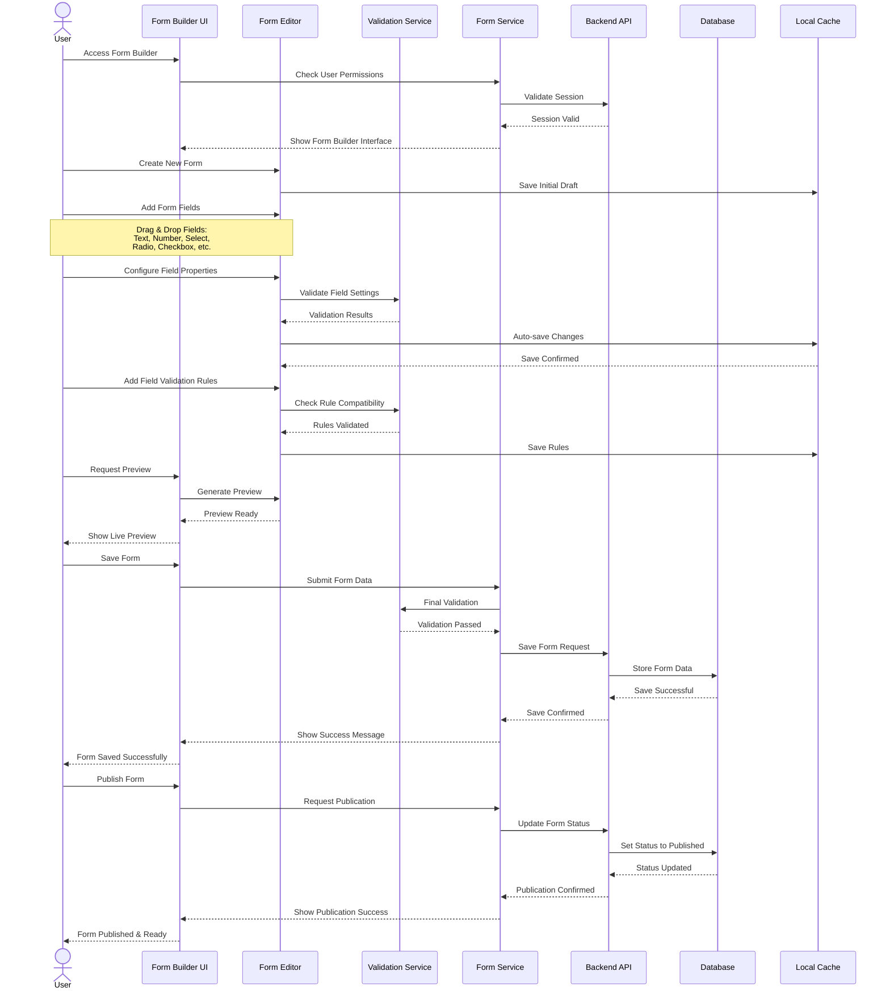

# Form Creation Flow

## Flow Description

1. **Initial Access & Authorization**
   - User accesses Form Builder
   - System validates user permissions and session

2. **Form Creation Start**
   - User initiates new form creation
   - System creates initial draft in local cache

3. **Form Design Process**
   - User adds various form fields through drag & drop
   - Each field addition is auto-saved
   - System validates field configurations in real-time

4. **Field Configuration**
   - User configures properties for each field
   - System validates settings and compatibility
   - Changes are automatically saved to prevent data loss

5. **Validation Rules**
   - User adds validation rules to fields
   - System checks rule compatibility
   - Rules are saved with field configurations

6. **Preview & Testing**
   - User can preview form at any time
   - System generates live preview
   - User can test form functionality

7. **Saving Process**
   - User saves the form
   - System performs final validation
   - Form data is stored in database
   - Success confirmation is shown

8. **Publication (Optional)**
   - User can publish the form when ready
   - System updates form status
   - Form becomes available for use 