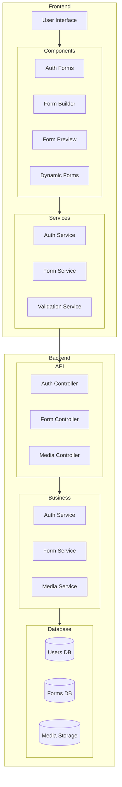
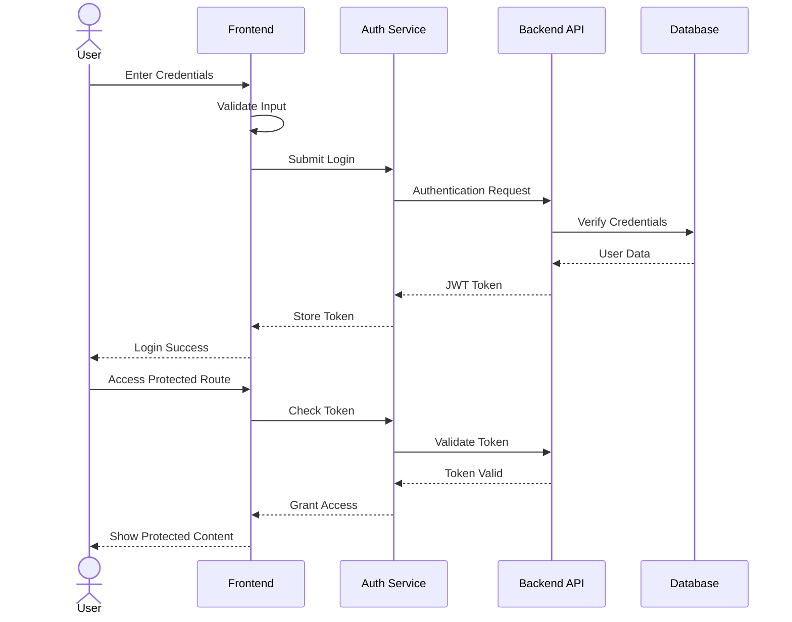
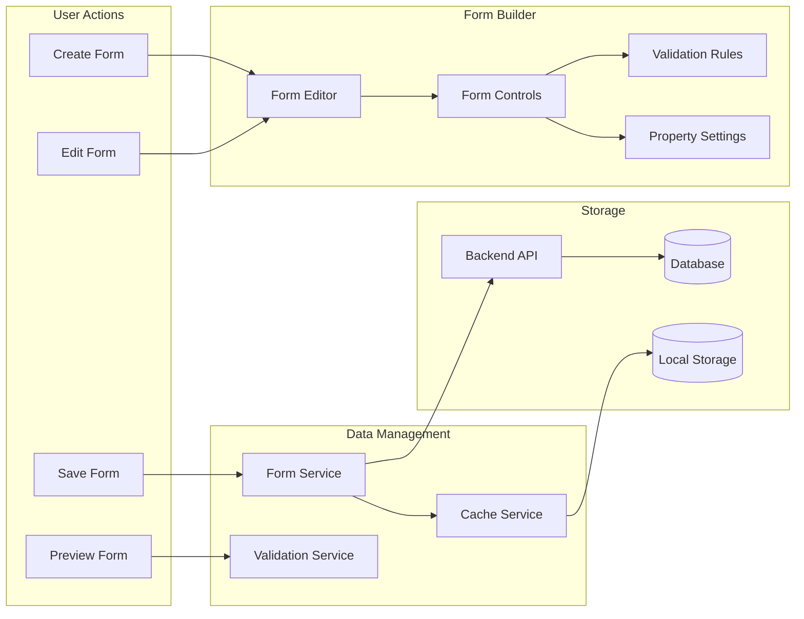
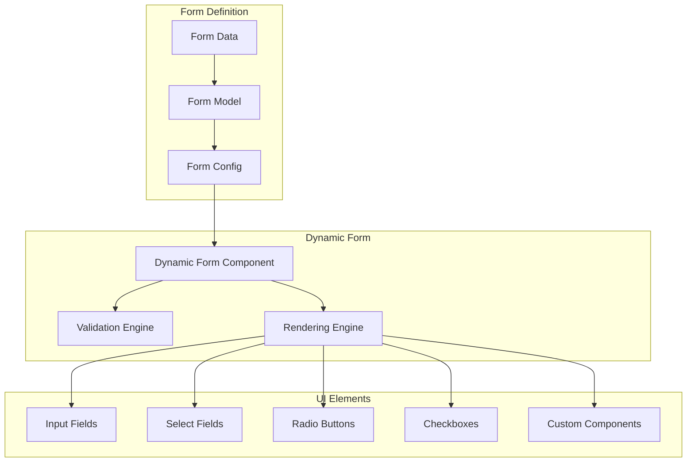
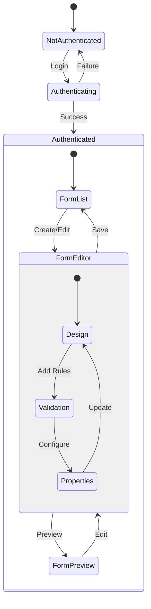
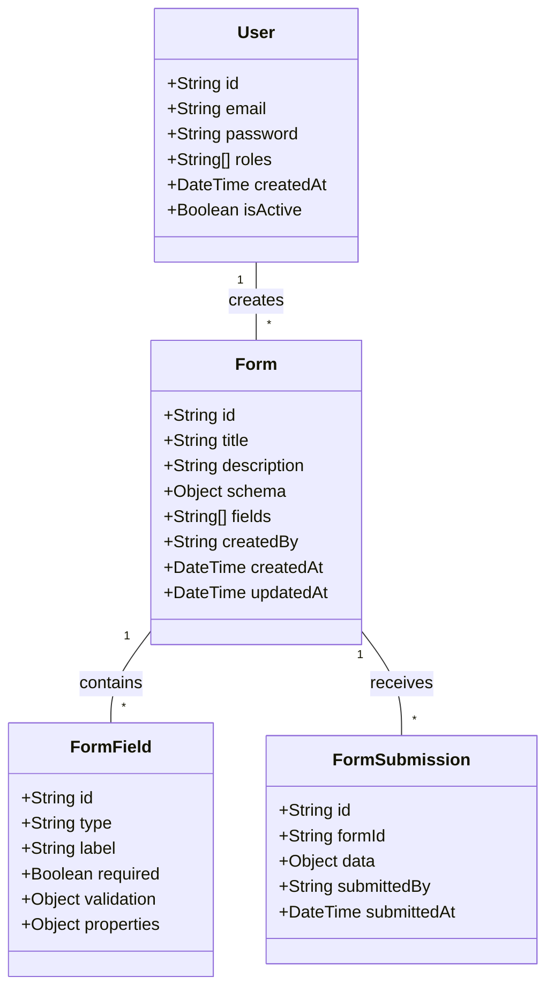

# SmartForm Builder System Architecture

## 1. Overall System Architecture

## 2. Authentication Flow

## 3. Form Builder Data Flow

## 4. Dynamic Form Rendering

## 5. State Management

## 6. Data Model
